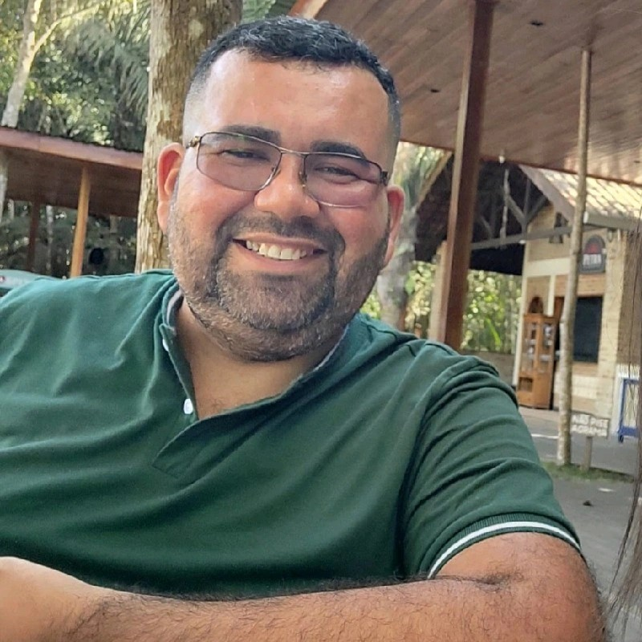

# Portfólio de Edson Carvalho - Desenvolvedor Front-end



Bem-vindo ao repositório do meu portfólio pessoal! Este projeto foi criado para apresentar minhas habilidades, projetos e minha jornada de transição de carreira para a área de desenvolvimento web front-end.

**[Acesse a versão online do portfólio aqui!](https://edson468.github.io/New-Portifolio/)** (Substitua pelo link do seu GitHub Pages quando estiver no ar)

---

## 🚀 Sobre o Projeto

Este é um site de página única (SPA - Single Page Application) desenvolvido com HTML, CSS e JavaScript puros. O objetivo é servir como um cartão de visitas digital, onde compartilho um pouco sobre mim, minhas competências técnicas e os projetos que venho desenvolvendo.

## 🛠️ Tecnologias Utilizadas

As tecnologias e ferramentas utilizadas na construção deste projeto foram:

- **HTML5**: Para a estrutura semântica do conteúdo.
- **CSS3**: Para a estilização e design responsivo.
- **JavaScript**: Para a interatividade, como o menu mobile.
- **Font Awesome**: Para os ícones.

### Tecnologias que estou estudando:
- TypeScript
- React e Next.js
- Tailwind CSS

## 📂 Estrutura do Projeto

```
├── img/                # Pasta com todas as imagens
├── index.html          # Arquivo principal da estrutura HTML
├── style.css           # Folha de estilos principal
├── script.js           # Código JavaScript para interatividade
└── README.md           # Este arquivo que você está lendo
```

## 📬 Contato

Vamos nos conectar! Fique à vontade para entrar em contato.

- **LinkedIn**: [Edson Carvalho](https://www.linkedin.com/in/edson-carvalho-213b051b1/)
- **Email**: [edson.carvalho.dev@gmail.com](mailto:edson.carvalho.dev@gmail.com)
- **WhatsApp**: [+55 (85) 98785-5611](https://wa.me/5585987855611)

---
*Projeto desenvolvido com ❤️ por Edson Carvalho.*